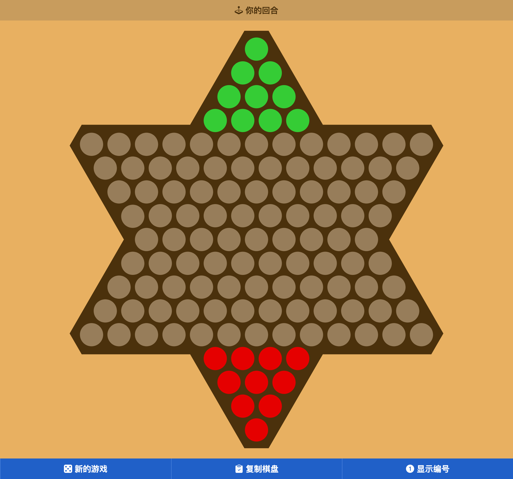

# 中国跳棋

## 简介

中国跳棋是一种古老的棋类游戏，它的规则简单，但是有着很高的复杂度。这个项目是一个中国跳棋的 AI 程序，它使用了 Alpha-Beta 搜索算法和 MTD(f) 搜索算法。

## TODO

- [x] Alpha-Beta search
- [x] Transposition table
- [x] Iterative deepening
- [x] MTD(f) search
- [x] Opening book
- [x] Null-Move Forward Pruning
